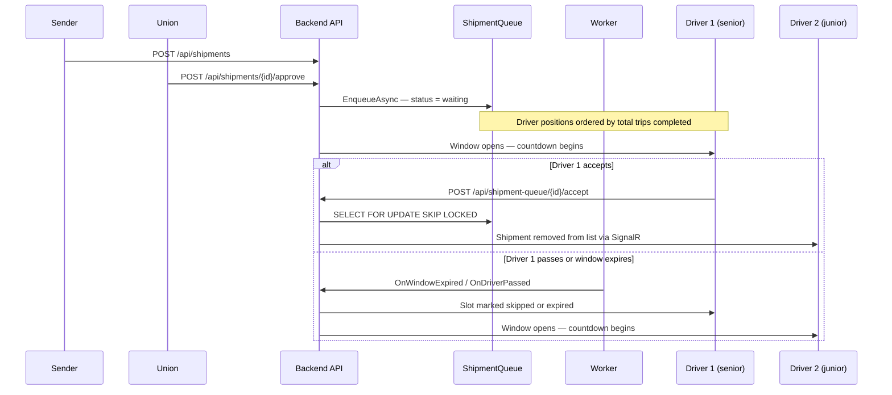
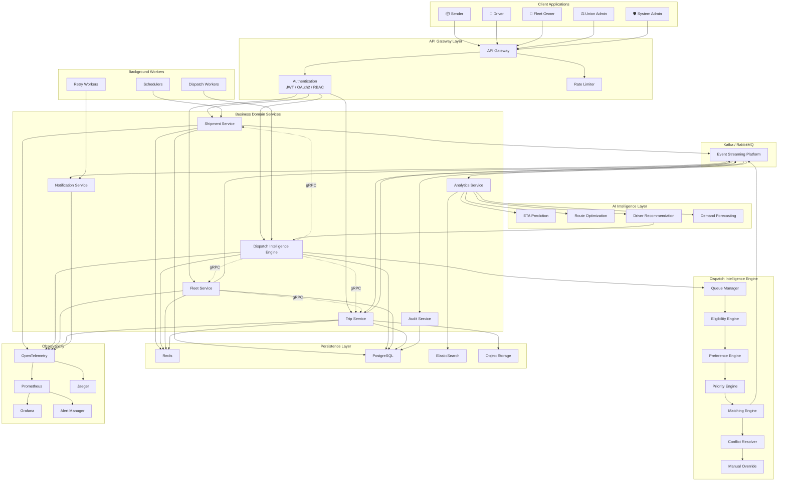

# FMP (Fleet Management Platform)

## Index
- [1. Description](#1-description)
- [2. Problem & Approach](#2-problem--approach)
- [3. Architecture](#3-architecture)
- [4. Tech Stack](#4-tech-stack)
- [5. Role Overview](#5-role-overview)
- [6. The Queue System](#6-the-queue-system)
- [7. Project Structure](#7-project-structure)
- [8. Getting Started](#8-getting-started)
- [9. API Overview](#9-api-overview)
- [10. Known Limitations](#10-known-limitations)

---

This project was developed and tested on **Windows**. Ensure the following are installed before running:

- **.NET 8.0 SDK**
- **Flutter SDK ^3.10.7**
- **PostgreSQL 14+**
- **Visual Studio Code** or **Visual Studio 2022**

---

## 1. Description

**FMP (Fleet Management Platform)** is a logistics coordination system that connects cargo senders, drivers, fleet owners, and regulatory unions through a single mobile application. Built around dispatch fairness and real-time synchronization, FMP replaces fragmented WhatsApp-based coordination with an automated, role-aware marketplace.

---

## 2. Problem & Approach

Indian logistics dispatching is typically a race to the phone — whoever responds first gets the job, regardless of experience or fairness. FMP solves this through a **Two-Tier Queue System**: time-slotted access windows ordered by driver experience (total trips completed) ensure every eligible driver gets a fair, sequential opportunity to claim shipments. Race conditions are eliminated at the database level via PostgreSQL row-level locking (`SELECT FOR UPDATE SKIP LOCKED`).

---

## 3. Architecture


| Component | Role | Technical Implementation |
|:---|:---|:---|
| **Flutter App** | Single mobile codebase serving all five roles | BloC/Provider for state management, `dio` for REST, `signalr_netcore` for real-time updates. |
| **ASP.NET Core 8 API** | REST endpoints + SignalR hub | `ShipmentQueueHub` handles real-time broadcasts; Middleware handles JWT validation and global exception logging. |
| **PostgreSQL** | Primary datastore | ACID-compliant relational storage; uses `FOR UPDATE SKIP LOCKED` for concurrency control. |
| **QueueMaintenanceWorker** | Background service | Inherits `BackgroundService`; runs a `PeriodicTimer` (or `Task.Delay`) loop to sweep expired assignments. |
| **Google Auth** | Identity verification | Uses `Google.Apis.Auth` for backend token validation (ID Token flow). |
| **SMTP / Brevo** | Transactional email | Integrated via `MailKit` and Brevo REST API for fallback. |

---

## 4. Tech Stack

| Layer | Technology | Purpose |
|:---|:---|:---|
| Backend | ASP.NET Core 8.0 | REST API and business logic |
| Database | PostgreSQL 14+ | Relational storage with ACID compliance |
| Real-time | SignalR | Push notifications for queue and shipment updates |
| Mobile | Flutter / Dart | Cross-platform UI for all five roles |
| Auth | JWT + Google OAuth | Stateless authentication and identity |
| Worker | BackgroundService | Queue window expiry and event maintenance |
| Email | MailKit / Brevo | OTP delivery and transactional notifications |

---

## 5. Role Overview

| Role | Capability |
|:---|:---|
| **Sender** | Creates shipments, manages cargo details, tracks delivery status |
| **Union** | Reviews and approves pending shipments, gates queue entry |
| **Driver** | Receives time-slotted shipment offers, manages active trips |
| **Fleet Owner** | Manages vehicles and drivers, monitors active assignments |
| **SysAdmin** | System metrics, user management, and manual dispatch overrides |

---

## 6. The Queue System



**Key technical properties:**
- **Concurrency Control**: Accept operations use `FromSqlRaw` to execute `SELECT * FROM shipment_queue WHERE id={0} FOR UPDATE SKIP LOCKED`, ensuring atomicity even under high concurrent load.
- **Experience-Based Dispatch**: Driver positions are calculated using `TotalTripsCompleted` stored in the `drivers` table, ensuring seniority-based priority.
- **Cascading Expiry**: When a window expires, `OnWindowExpiredAsync` updates the current driver's slot to `Expired`, opens a window for the *next* driver for the *same* shipment, and opens the *next* shipment for the *current* driver simultaneously.
- **Real-time Synchronization**: SignalR broadcasts `ShipmentAccepted` events to all connected clients, triggering immediate local list updates and removal of claimed items.

---

## 7. Project Structure

```text
fmp-dep-26/
├── src/
│   ├── FmpBackend/
│   │   ├── Controllers/       # API endpoints — auth, shipments, queue, admin
│   │   ├── Models/            # EF Core entities — User, Shipment, QueueEvent, Trip
│   │   ├── Services/          # Business logic — queue dispatch, role resolution, OTP
│   │   ├── Repositories/      # Data access layer — PostgreSQL queries
│   │   └── Workers/           # QueueMaintenanceWorker background service
│   ├── fmp_app/
│   │   ├── lib/               # Flutter source — screens, providers, API clients
│   │   └── pubspec.yaml       # Flutter dependencies
│   └── database/
│       └── schema/            # Ordered SQL scripts for schema and seed data
└── README.md
```

---

## 8. Getting Started

### Prerequisites

- .NET SDK 8.0
- Flutter SDK ^3.10.7
- PostgreSQL 14+

### Environment Variables

Set the following in `src/FmpBackend/appsettings.json`:

```json
{
  "Jwt": { "Key": "<base64-secret>", "ExpiryMinutes": 1440 },
  "ConnectionStrings": { "DefaultConnection": "<postgres-connection-string>" },
  "Google": { "ClientId": "<google-oauth-client-id>" },
  "Smtp": { "Host": "", "Port": 587, "User": "", "Pass": "" }
}
```

### Database Setup

Run the scripts in `src/database/schema/` in this order:

```
00user.sql
01roles.sql
02union.sql
03drivers.sql
trips.sql
support.sql
logs.sql
updaters_and_views.sql
insert_driver_vehicle_fleetmgr.sql
```

### Run Backend

```bash
cd src/FmpBackend
dotnet run
# API available at http://localhost:5153
```

### Run Flutter App

```bash
cd src/fmp_app
flutter pub get
flutter run
```

> Update `lib/core/network/api_client.dart` with your backend host if not running locally.

---

## 9. API Overview

| Controller | Route Prefix | Responsibility |
|:---|:---|:---|
| `AuthController` | `/auth` | Email OTP, Google Sign-In, role resolution |
| `ShipmentController` | `/api/shipments` | Shipment CRUD, approval, rejection, search |
| `QueueEventController` | `/api/queue-events` | Queue event lifecycle, driver slot preview |
| `ShipmentQueueController` | `/api/shipment-queue` | Enqueued shipment status, accept, pass |
| `TripsController` | `/api/trips` | Trip creation, status updates, GPS tracking |
| `DriverController` | `/drivers` | Driver onboarding and fleet-owner lookups |
| `VehiclesController` | `/vehicles` | Vehicle CRUD and bulk management |
| `SysAdminController` | `/sysadmin` | Metrics, logs, user management, force-assign |

---
## 10. Future Architecture


